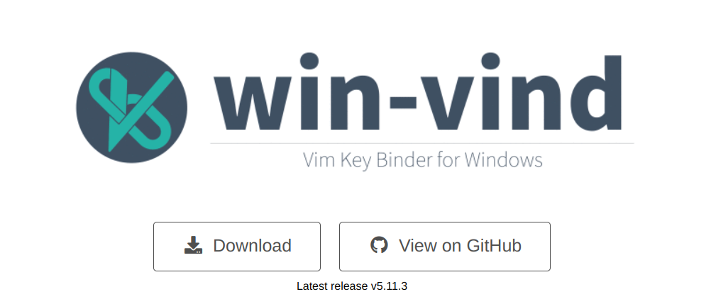
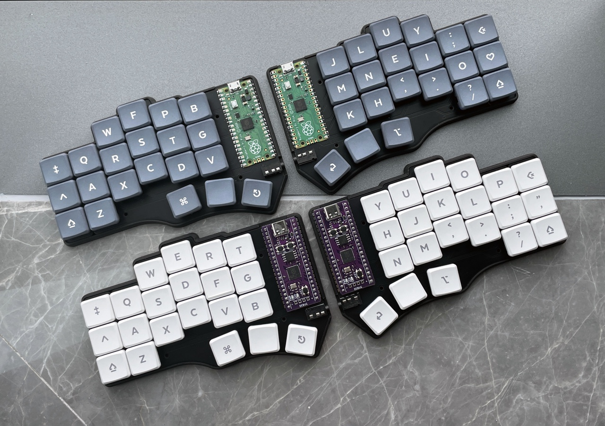
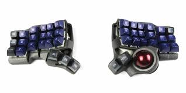

# 下一步?

<blockquote class="reddit-embed-bq" data-embed-height="380"><a href="https://www.reddit.com/r/vim/comments/1b4ppxl/comment/kt098pr/">Comment</a>  by<a href="https://www.reddit.com/user/cbheithoff/">u/cbheithoff</a> from discussion<a href="https://www.reddit.com/r/vim/comments/1b4ppxl/do_most_vim_users_actually_not_know_the_basics_of/"><no value=""></no></a>  in<a href="https://www.reddit.com/r/vim/">vim</a></blockquote>